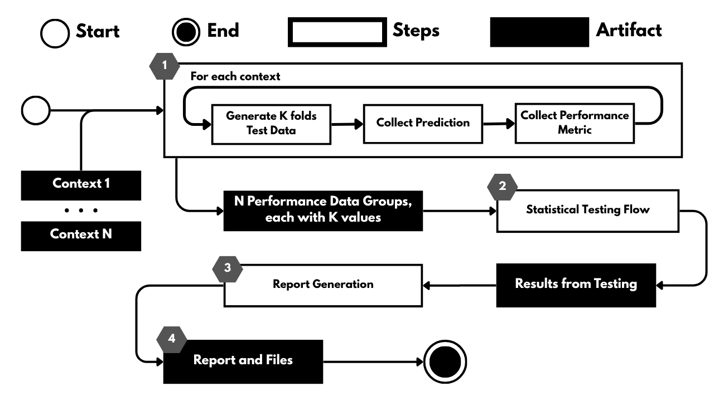
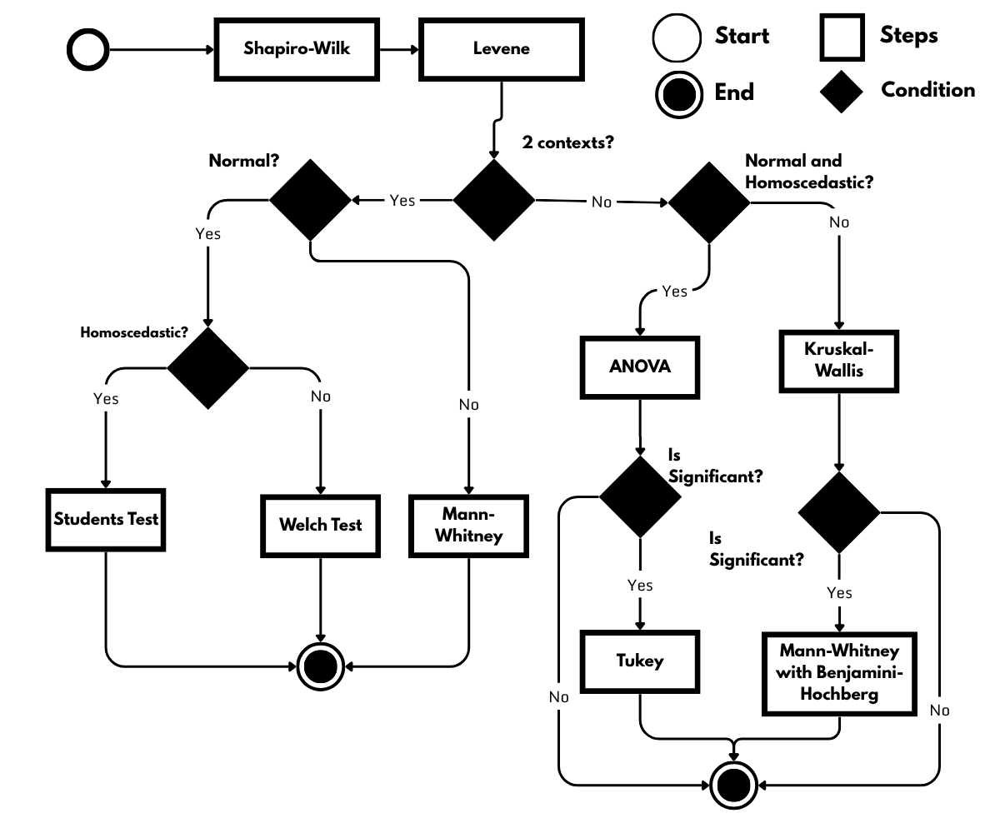
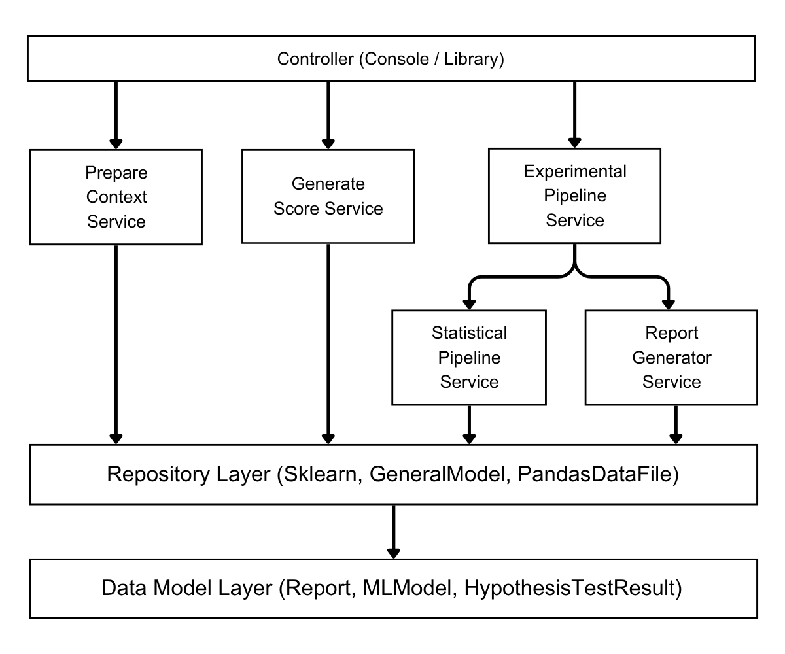

# MLExp
MLExp, an open-source tool that automates the comparison of supervised machine learning models' performance, thereby supporting a systematic experimental process. The tool allows data scientists to assess performance changes between versions of machine learning models with greater statistical rigor and automation.

## 🛠️ Installation

### From source (development environment)
Download the source code by cloning the repository or click on  "Download ZIP" to download the latest stable version.

Install it by navigating to the proper directory and running:

```sh
pip install -e .
```

The result of ml_experimentation is written in HTML and CSS, so a modern browser is required to view it correctly.

You need [Python 3](https://python3statement.github.io/) to run the package. Other dependencies can be found in the requirements files available in `pyproject.toml`. You can activate a virtual environment with all project dependencies and the required version using [Poetry](https://python-poetry.org).

With Poetry installed, simply run the following command in the project root folder (where `pyproject.toml` is present):   

```sh
poetry shell
```

### From PIP
To install the library via Pip use the following command:

```
pip install ml_experimentation
```

To import and use this code internally, use the following line of code:

```python
from ml_exp import MLExp
```

## ▶️ Quickstart

During model training, you may organize the model-trained objects and load the feature set into a Pandas DataFrame (X_test) and the corresponding targets into another Pandas DataFrame (y_test). It's possible to save a model-trained object in Pickle, ONNX, or MLflow, while X_text and y_test can be stored in data files supported by the Pandas library.

You can apply experimentation in our Python code by instantiating an `MLExp` object and referencing it in a local variable. During instantiation, you need to provide parameters that affect how the experiment works and where to store reports.

```python
ml_exp = MLExp(
	scores_target = ["accuracy", "roc_auc"],
	report_name="test_case"
)
```

Using the local variable to reference the library instance, you need to add test data with the `add_test_data()` instance method. In this function, you need to inform X_test (features), y_test (target), and name to refer to your own set of data (must be unique). X_test and y_test can be Pandas DataFrame objects or paths to files supported by the Pandas library (csv, parquet, txt, json...).

```python
ml_exp.add_test_data(
		test_data_name="test_data",
		X_test="tests/local/models/x_test.csv",
		y_test="tests/local/models/y_test.csv"
	)
```

To add context, combining a model trained with test data to use in an experiment, you use the `add_context()` instance method. During the call, you need to provide the model trained (can be an object or a path), what test data will be applied to this model, and a name to refer to your own context (must be unique). For this tool, each model is expected to use distinct, independent test bases.

```python
ml_exp.add_context(
		context_name="model_0_sklearn",
		model_trained="tests/local/models/model_0.pkl",
		ref_test_data="test_data"
	)
```

When executing the `run()` instance method, you will apply the continuous experimentation pipeline and generate the report (which, if not specified, will always be generated in the root folder of your project within `reports/general_report`).

### Usage examples
Within the local tests folder, there are Python scripts that illustrate how to use the library in various scenarios. All artifacts involved, such as data used, trained models, and the results generated by the tool, are located in tests/local.


### Command Line Interface
You can use the command line to run continuous experimentation around a specific metric, generate a report, and capture the best model (if any) around a metric. 

NOTE: From the command line, it is only possible to generate the report and the best model result for a single metric at a time.

You can check the available commands by running the following command:

```sh
ml_exp --h
```

An example of using the command line by passing a folder with several Sklearn models saved in Pickle format (.pkl), an X_test and y_test saved in CSV format and indicating, in the optional parameter, the name of the report that will be generated.

```sh
ml_exp accuracy --test_data_paths tests/local/data/x_test.csv tests/local/data/y_test.csv test_data --contexts tests/local/models/model_0.pkl test_data model_test_1 tests/local/models/model_4.pkl test_data model_test_4 --report_name cli
```

# Tool Workflow
Two central concepts were defined to guide the tool's operation: experiment and context. A **context** is a trained machine learning model that predicts a target variable from a dataset, generating performance metrics that are subsequently used in the statistical testing process. An **experiment** is a set of contexts executed to generate performance data used for statistical comparison. These metrics are then used to identify which contexts exhibit significant performance differences and, if any exist, to determine the context that achieved the best performance.

The tool allows data scientists to map test data from various file formats into a Pandas DataFrame (e.g., CSV, JSON, Parquet). It can also accept an already instantiated Pandas DataFrame object. 

The user can independently load each trained supervised machine learning model saved in a serialized format, such as Pickle or ONNX. The tool also accepts instantiated model objects from the scikit-learn ecosystem.

During the model mapping process, the user must specify which previously mapped test dataset to use with each model. The pair consisting of a trained model and its corresponding test dataset is referred to as a context.

After all contexts have been mapped, the operation of the tool can be summarized in the following steps to apply and evaluate the experiment results:



## Statistical Tests Flow
For independent evaluations comparing two groups, the Student's t-test is appropriate when the assumptions of normality and homoscedasticity are met. If normality holds but homoscedasticity is violated, Welch's t-test is applied to preserve statistical power, following best practices for algorithmic evaluation. Nonparametric tests, such as the Mann-Whitney test, are reserved for non-normal distributions.

Conversely, for three or more independent groups, the standard ANOVA test is recommended when the data is normally distributed and homoscedastic. For non-normal distributions, the Kruskal-Wallis test is applied. If significant differences are detected among multiple groups, proper post hoc tests, such as Tukey’s HSD for ANOVA, must be performed. When performing multiple pairwise comparisons using nonparametric methods like the Mann-Whitney test, p-value adjustments, such as the Benjamini-Hochberg procedure, are strictly applied to control the False Discovery Rate (FDR) and prevent type I error inflation during model selection. MLExp aims to automate this rigorous process, as illustrated in Figure below.




ATTENTION! While the tool also allows models to be mapped to the same test dataset (a common practice in offline evaluations during development), it's important to note a rule restricting the user-supplied input parameters. Since the current statistical workflow is strictly designed for independent samples, applying it to shared test datasets violates the fundamental assumption of independence. Consequently, this specific use may compromise the statistical validity of the comparison.

## Architecture



